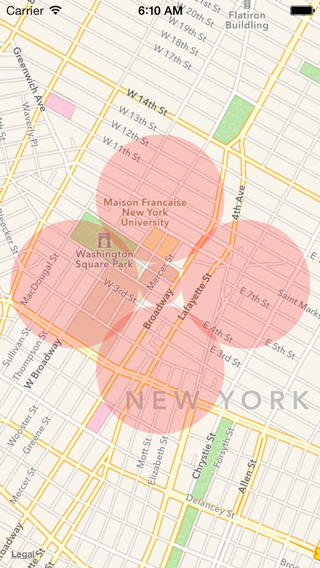

# Circles

This small iOS project demonstrates how to draw 5 circles on a map. The first is drawn at a given center coordinate and with a given radius. The rest are "cushions" that completely surround the center region, but do not overlap it. The cushions are offset 4x the radius of the center circle, and their radius is 3x that of the center circle.

Probably better seen than explained:

Why did I want to do this? [Jacked](http://jacked.io) relies heavily on the CLLocationManager didExitRegion capability. The problem is that it's not too accurate and often doesn't fire. The hope is to use didEnterRegion on the cushions as a backup indicator.

Shout out to a couple Stack Overflow answers that helped get this done:
* [This one](http://stackoverflow.com/questions/16850024/calculation-that-calculates-the-new-latitude-and-longitude-based-on-a-starting-p) for the code that calculates offset from a center coordinate
* [This one](http://stackoverflow.com/questions/4189621/setting-the-zoom-level-for-a-mkmapview) for an easy way to set the zoom of MKMapView